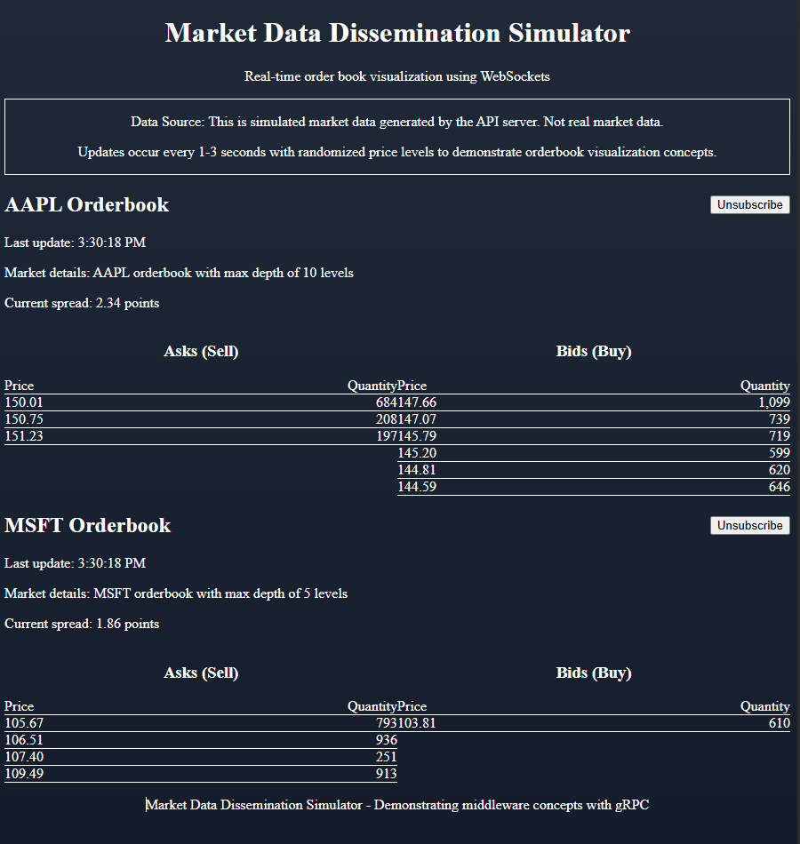

# Market Data Dissemination Simulator

A client-server application demonstrating middleware concepts and distributed asynchronous systems using gRPC for real-time market data streaming, with a modern web frontend.

## Project Overview

This project simulates a market data system where:

1. **Server**: Manages order books for different financial instruments and disseminates market data
2. **Client**: Connects to the server and subscribes to receive real-time market data updates
3. **Web Frontend**: Visualizes the orderbook data in a modern UI

The communication is implemented using gRPC with bidirectional streaming, allowing clients to:
- Subscribe/unsubscribe to specific instruments
- Receive full order book snapshots upon subscription
- Receive incremental updates to maintain order book state

## Architecture

### Server (C#)
- Reads instrument configuration from `appsettings.json`
- Manages order books for each configured instrument
- Simulates market activity (add/replace/remove orders)
- Broadcasts market data to subscribed clients
- Handles client connections and subscription requests

### Console Client (C#)
- Connects to the server via gRPC
- Allows users to subscribe/unsubscribe to instruments
- Displays order book snapshots and incremental updates
- Maintains connection to receive continuous streaming data

### API Server (Node.js)
- Connects to the gRPC server (or simulates it)
- Provides WebSocket API for real-time data
- Provides REST endpoints for instrument information
- Acts as a bridge between the C# server and web frontend

### Web Frontend (Next.js)
- Modern, responsive UI for orderbook visualization
- Connects to the API server via WebSocket
- Displays real-time orderbook updates
- Allows subscribing/unsubscribing to different instruments

## Protocol
- Uses Protocol Buffers for message definition
- Implements bidirectional streaming with gRPC
- Handles two types of updates:
  - **Snapshots**: Complete state of the order book
  - **Incremental Updates**: Changes to apply to the current order book state

## Prerequisites

- .NET 9.0 SDK or higher
- Node.js 18+ and npm
- Visual Studio 2022 or another compatible IDE (optional)

## Building the Project

### Building the .NET Components:

```bash
# Build the solution
dotnet build
```

### Setting up the Web Frontend:

```bash
# Install API server dependencies
cd api
npm install

# Install frontend dependencies
cd ../frontend
npm install
```

## Running the Application

You'll need to run the C# server, Node.js API, and Next.js frontend:

### C# Server:

```bash
dotnet run --project Server
```

### Node.js API Server:

```bash
cd api
npm start
```

### Next.js Frontend:

```bash
cd frontend
npm run dev
```

Then open [http://localhost:3000](http://localhost:3000) in your browser.

## Usage

### Console Client:

In the client console, use the following commands:
- `sub 1` - Subscribe to instrument with ID 1
- `sub 2` - Subscribe to instrument with ID 2
- `unsub 1` - Unsubscribe from instrument with ID 1
- `quit` - Exit the application

### Web Frontend:

1. Open [http://localhost:3000](http://localhost:3000) in your browser
2. Click the "Subscribe" button for any instrument
3. Watch real-time orderbook updates
4. Click "Unsubscribe" to stop receiving updates

## Screenshots



## Project Structure Explanation

The project is organized as follows:

```
MarketDataDissemination/
├── Server/                   # C# Server application
│   ├── appsettings.json      # Instrument configuration
│   ├── Program.cs            # Application entry point
│   ├── Server.cs             # Main server class
│   ├── Orderbook.cs          # Orderbook implementation
│   ├── OrderbookService.cs   # gRPC service implementation
│   └── DomainModels.cs       # Domain model classes
├── Client/                   # C# Console client application
│   ├── Program.cs            # Application entry point
│   ├── Client.cs             # gRPC client implementation
│   └── DomainModels.cs       # Client-side domain models
├── Shared/                   # Shared code between projects
│   └── Proto/                # Protocol buffer definitions
│       └── orderbook.proto   # gRPC service definition
├── api/                      # Node.js API server
│   ├── index.js              # API server implementation
│   └── package.json          # Node.js dependencies
└── frontend/                 # Next.js Web Frontend
    ├── app/                  # Next.js app components
    │   ├── components/       # React components
    │   │   └── Orderbook.tsx # Orderbook visualization 
    │   ├── page.tsx          # Main page component
    │   └── globals.css       # Global styles
    └── package.json          # Node.js dependencies
```

## Key Technical Concepts Demonstrated

1. **Client-Server Architecture**:
   - Clear separation of responsibilities
   - Bidirectional communication

2. **Middleware Understanding**:
   - gRPC for service definition and communication
   - Protocol Buffers for message serialization
   - Streaming APIs for real-time data
   - WebSockets for web client communication

3. **Distributed Systems Patterns**:
   - Snapshot and incremental update pattern
   - Subscription-based data dissemination
   - Asynchronous communication

4. **Frontend Development**:
   - Modern React with Next.js
   - Real-time data visualization
   - WebSocket communication
   - Responsive UI design

5. **Real-world Market Data Concepts**:
   - Order book management
   - Bid/ask price levels
   - Trade simulation

## Learning Outcomes

Building this project helps demonstrate understanding of:

1. How to design and implement cross-service communication
2. Real-time data streaming architecture patterns
3. Distributed system design and implementation
4. Market data structures and dissemination techniques
5. Modern web frontend development
6. Full-stack development with multiple technologies

This project serves as a foundation that can be extended with additional features to demonstrate more advanced concepts in distributed systems and financial technology.