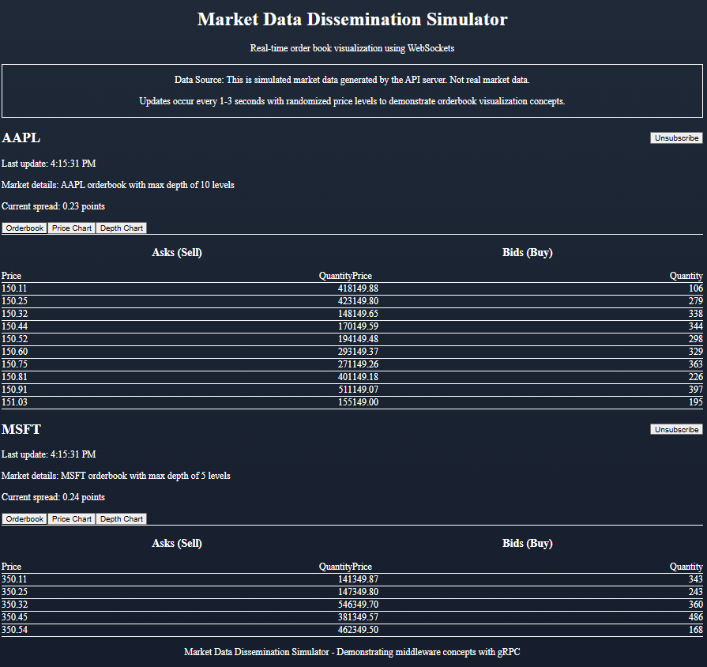
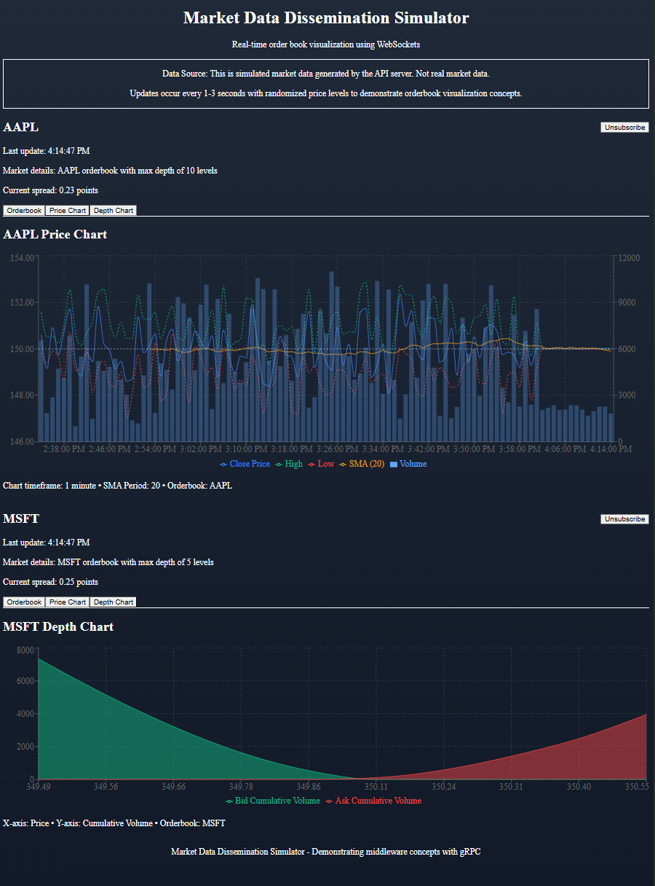

# Market Data Dissemination Simulator

**I built this project in an afternoon for learning purposes and to demonstrate my technical skills in distributed systems and financial market data visualization. It features a C# backend generating simulated market data, Node.js middleware for data distribution via gRPC, and a modern Next.js frontend showcasing interactive orderbooks, candlestick price charts, and market depth visualization.**

A sophisticated client-server application demonstrating middleware concepts and distributed asynchronous systems using gRPC for real-time market data streaming, with a responsive, data-rich web frontend.

## Project Overview

This project simulates a professional-grade market data system where:

1. **Server**: Manages order books for different financial instruments and disseminates market data
2. **Client**: Connects to the server and subscribes to receive real-time market data updates
3. **Web Frontend**: Visualizes the orderbook data with dynamic, interactive charts

The communication is implemented using industry-standard gRPC with bidirectional streaming, allowing clients to:
- Subscribe/unsubscribe to specific instruments
- Receive full order book snapshots upon subscription
- Receive incremental updates to maintain order book state

## Screenshots

### Orderbook View

*Real-time orderbook displaying bid/ask prices and quantities for multiple instruments*

### Price Chart and Depth Chart

*Interactive price history with candlestick chart (top) and market depth visualization (bottom)*

## Video Demonstration

A video walkthrough of the application in action is available:

[Frontend Demonstration](./frontend-demo.gif)

*This demonstration shows the real-time functionality of the orderbook updates, interactive price charts, and market depth visualization as data streams from the server.*

## Architecture

### Server (C#)
- Reads instrument configuration from `appsettings.json`
- Manages order books for each configured instrument
- Simulates market activity (add/replace/remove orders)
- Broadcasts market data to subscribed clients
- Handles client connections and subscription requests

### Console Client (C#)
- Connects to the server via gRPC
- Allows users to subscribe/unsubscribe to instruments
- Displays order book snapshots and incremental updates
- Maintains connection to receive continuous streaming data

### API Server (Node.js)
- Connects to the gRPC server (or simulates it)
- Provides WebSocket API for real-time data
- Provides REST endpoints for instrument information
- Acts as a bridge between the C# server and web frontend

### Web Frontend (Next.js)
- Modern, responsive UI for financial data visualization
- Connects to the API server via WebSocket
- Displays real-time orderbook, price, and depth chart updates
- Features multiple visualization components:
  - Orderbook with bid/ask prices and quantities
  - Candlestick chart with moving averages
  - Depth chart showing cumulative volume at price levels
- Allows subscribing/unsubscribing to different instruments

## Protocol
- Uses Protocol Buffers for message definition
- Implements bidirectional streaming with gRPC
- Handles two types of updates:
  - **Snapshots**: Complete state of the order book
  - **Incremental Updates**: Changes to apply to the current order book state

## Prerequisites

- .NET 9.0 SDK or higher
- Node.js 18+ and npm
- Visual Studio 2022 or another compatible IDE (optional)

## Building the Project

### Building the .NET Components:

```bash
# Build the solution
dotnet build
```

### Setting up the Web Frontend:

```bash
# Install API server dependencies
cd api
npm install

# Install frontend dependencies
cd ../frontend
npm install
```

## Running the Application

There are several ways to run the application:

### Option 1: Streamlined Launcher (Recommended)

#### For Windows users:
```bash
# In Command Prompt
run.bat
# or
run.cmd  # Alternative command file with identical functionality

# In PowerShell
.\run.bat
# or
.\run.cmd
```

#### For macOS/Linux users (or Git Bash on Windows):
```bash
# Make the script executable first
chmod +x run.sh

# Run the shell script
./run.sh
```

#### For any operating system (requires Node.js):
```bash
# In PowerShell or Command Prompt
node start.js

# In Git Bash, Linux or macOS terminal
./start.js  # If you've made it executable with chmod +x start.js
# or
node start.js
```

These launcher scripts will start all components in the correct order:
1. C# Server
2. C# Client
3. Node.js API Server
4. Next.js Frontend

### Option 2: Manual Start (Start each component separately)

You'll need to run the C# server, Node.js API, and Next.js frontend in separate terminals:

#### C# Server:
```bash
dotnet run --project Server
```

#### Node.js API Server:
```bash
cd api
node index.js
```

#### Next.js Frontend:
```bash
cd frontend
npm run dev
```

Then open [http://localhost:3000](http://localhost:3000) in your browser.

## Usage

### Console Client:

In the client console, use the following commands:
- `sub 1` - Subscribe to instrument with ID 1
- `sub 2` - Subscribe to instrument with ID 2
- `unsub 1` - Unsubscribe from instrument with ID 1
- `quit` - Exit the application

### Web Frontend:

1. Open [http://localhost:3000](http://localhost:3000) in your browser
2. Click the "Subscribe" button for any instrument
3. Watch real-time orderbook updates
4. Use the tabs to switch between orderbook, price chart, and depth chart views

## Project Structure Explanation

The project is organized as follows:

```
MarketDataDissemination/
├── Server/                   # C# Server application
│   ├── appsettings.json      # Instrument configuration
│   ├── Program.cs            # Application entry point
│   ├── Server.cs             # Main server class
│   ├── Orderbook.cs          # Orderbook implementation
│   ├── OrderbookService.cs   # gRPC service implementation
│   └── DomainModels.cs       # Domain model classes
├── Client/                   # C# Console client application
│   ├── Program.cs            # Application entry point
│   ├── Client.cs             # gRPC client implementation
│   └── DomainModels.cs       # Client-side domain models
├── Shared/                   # Shared code between projects
│   └── Proto/                # Protocol buffer definitions
│       └── orderbook.proto   # gRPC service definition
├── api/                      # Node.js API server
│   ├── index.js              # API server implementation
│   ├── historyData.js        # Price history data generator
│   └── package.json          # Node.js dependencies
└── frontend/                 # Next.js Web Frontend
    ├── app/                  # Next.js app components
    │   ├── components/       # React components
    │   │   ├── Orderbook.tsx # Orderbook visualization 
    │   │   ├── CandlestickChart.tsx # Price chart visualization
    │   │   └── DepthChart.tsx # Market depth visualization
    │   ├── page.tsx          # Main page component
    │   └── globals.css       # Global styles
    └── package.json          # Node.js dependencies
```

## Key Technical Concepts Demonstrated

1. **Client-Server Architecture**:
   - Clear separation of responsibilities
   - Bidirectional communication
   - Real-time data streaming

2. **Middleware Understanding**:
   - gRPC for service definition and communication
   - Protocol Buffers for message serialization
   - Streaming APIs for real-time data
   - WebSockets for web client communication

3. **Distributed Systems Patterns**:
   - Snapshot and incremental update pattern
   - Subscription-based data dissemination
   - Asynchronous communication
   - Event-driven architecture

4. **Frontend Development**:
   - Modern React with Next.js
   - Interactive data visualization
   - WebSocket real-time communication
   - Responsive UI design
   - Component-based architecture

5. **Real-world Market Data Concepts**:
   - Order book management and visualization
   - Bid/ask price level representation
   - Price chart with OHLC (Open, High, Low, Close) data
   - Market depth visualization
   - Simple Moving Average (SMA) calculation
   - Cumulative volume calculation

## Learning Outcomes

Building this project demonstrates proficiency in:

1. Designing and implementing cross-service communication in a microservices architecture
2. Real-time data streaming using industry-standard protocols
3. Distributed system design and implementation for financial data
4. Market data structures and visualization techniques
5. Modern web frontend development with React and Next.js
6. Full-stack development across multiple technology stacks (C#, Node.js, TypeScript)
7. **Programming with Generative AI as a force-multiplier for development productivity**
8. **Rapidly learning and implementing new technologies through AI-augmented workflows**
9. **Leveraging AI tools to expand technical capabilities and accelerate development cycles**

This project exemplifies practical implementation of financial technology concepts and serves as a foundation for more advanced trading systems, algorithmic trading strategies, or market analysis tools.

## AI-Augmented Development Philosophy

This project embraces the modern development paradigm where AI and human creativity work in tandem. Some key insights from this approach:

- **Humans shouldn't code alone**: The combination of human domain knowledge and AI capabilities creates exponentially better outcomes than either working in isolation
- **Accelerated skill acquisition**: AI tools enable developers to quickly master unfamiliar technologies and implement solutions in domains outside their primary expertise
- **Focus on architecture and design**: With AI handling routine coding tasks, human developers can concentrate on high-level system design, architectural decisions, and user experience
- **Continuous learning**: Working with AI tools instills a cycle of constant learning and adaptation to new techniques, frameworks, and patterns

The future of software development lies not in resisting AI tools but in learning to collaborate with them effectively, transforming how we approach problem-solving and implementation.